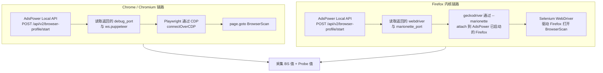

# AdsPower 指纹横向对比工具

批量启动 AdsPower profile，分别走 Playwright/CDP（Chrome/Chromium）或 Selenium/Marionette（Firefox 内核）连入已启动环境，采集 BrowserScan 实测值与一组 JS Probe 辅助值，输出可横向对比的 HTML 与 JSON 报告。报告本身不做通过/失败判定，只展示「设置值 / BS值 / Probe值 / 备注」四类信息，便于人工定位问题来源。

## 适用场景

- 批量验收环境指纹是否按配置生效：一次对比多个 profile 的 UA、时区、语言、屏幕、WebGL、Canvas、WebRTC 等字段，减少重复手工检查。
- 明确区分问题来源：报告把「设置值」「BS值」「Probe值」分开，能直接看出问题是配置没下发、浏览器运行时没生效，还是 BrowserScan 没采到。
- 降低误判：Canvas、Audio、WebGL Image、WebRTC 这类字段不会被粗暴写成通过/失败，而是提供中性备注和 Probe 实测值，由人工基于证据判断。
- 留下可回溯证据：HTML 适合人工查看和转发，JSON 保留脱敏后的完整排查数据，方便回归、复盘和交给开发定位。

## 工作流程总览

```mermaid
flowchart LR
    A["编辑 config.local.json"] --> B["启动 AdsPower 客户端"]
    B --> C["npm run start -- --config config.local.json"]
    C --> D["读取设置值<br/>后端或 Local API"]
    D --> E["按 profileIds 依次启动 profile<br/>Local API /api/v2/browser-profile/start"]
    E --> F{"浏览器类型"}
    F -->|Chrome / Chromium| G["Playwright 连接<br/>ws.puppeteer / debug_port"]
    F -->|Firefox 内核| H["Selenium 连接<br/>webdriver + marionette_port"]
    G --> I["打开 BrowserScan 首页"]
    H --> I
    I --> J["采集 BS 值<br/>window._getComponent 快照"]
    J --> K["执行 runtime Probe<br/>UA / WebGL / Canvas / Audio / WebRTC ..."]
    K --> L{"稳定性复测"}
    L -->|stabilityRuns = 1| M["生成 reports/*.html<br/>reports/*.json"]
    L -->|stabilityRuns 大于 1| N["session / restart 多轮采集<br/>再生成 reports/*"]
    N --> M
    M --> O["人工查看 / reports/*.html"]
    M --> P["差异对比<br/>npm run compare-reports"]
```



## 快速开始

1. **安装依赖**（首次或拉新代码后）：

    ```bash
    # Windows (PowerShell)
    npm.cmd install

    # macOS / Linux
    npm install
    ```

2. **复制配置模板**：

    ```powershell
    # Windows
    Copy-Item config.example.json config.local.json
    ```

    ```bash
    # macOS / Linux
    cp config.example.json config.local.json
    ```

3. **填入 `config.local.json`**：至少需要 `backendBaseUrl`、`localApiBaseUrl`、`browserScanUrl`、`profileIds`。`apiKey` 通过环境变量传入，不写进配置文件。完整字段含义见 [docs/runbook.md § 配置文件字段说明](docs/runbook.md#配置文件字段说明)。

4. **启动 AdsPower 客户端**，确认 Local API 可达（默认 `http://local.adspower.com:50325`）。

5. **设置环境变量并执行采集**：

    ```powershell
    # Windows
    $env:ADSPOWER_API_KEY="<你的 API key>"
    npm.cmd run start -- --config config.local.json
    ```

    ```bash
    # macOS / Linux
    export ADSPOWER_API_KEY="<你的 API key>"
    npm run start -- --config config.local.json
    ```

6. **查看报告**：

    - `reports/fingerprint-report-*.html`：人工查看的横向对比报告。
    - `reports/fingerprint-report-*.json`：脱敏后的完整排查数据，含 `browserScan.componentSnapshot` 原始快照、Probe 原始值、字段校验备注。

第一次跑通后，再看 [docs/runbook.md](docs/runbook.md) 学习如何解读报告、跑稳定性复测、对比两份报告和排查常见问题。

## 浏览器连接链路

工具不会启动你本机的 Chrome 或 Firefox，只会"附加"到 AdsPower 已经启动好的内核环境上。



> 关键点：Firefox 不是"启动本机 Firefox"，而是 geckodriver 通过 `marionette_port` 附加到 AdsPower 已经启动的 Firefox 内核。如果 AdsPower 没有返回 `webdriver` 或 `marionette_port`，Firefox 采集会直接报错，以避免误采到本机指纹。

浏览器类型由 `settings.browser` 或 `browser_kernel_config.type` 自动识别，调用方不需要在配置里手动选择。

## 报告怎么看

报告围绕四个数据维度展开，每一行是一个指纹字段：

| 列 | 含义 | 用途 |
|---|---|---|
| 设置值 | AdsPower 后端 / Local API 读到的指纹配置 | 看"配置有没有下发到 profile" |
| BS值 | BrowserScan 第三方页面在当前浏览器环境里的实测值 | 看"profile 实际暴露的指纹" |
| Probe值 | 工具在当前浏览器环境里执行 JS 得到的辅助实测值 | 只在备注里以 `Probe实测：xxx` 出现，用来判断"设置值有没有真正在运行时生效" |
| 备注 | 字段依赖、校验结果、清理提示、profile 级摘要 | 解释差异、定位失败环节 |

> Probe 是辅助手段，**不能顶替 BS 值**。BrowserScan 没采到时，BS 列仍应显示"未获取"。

### profile 整体状态

| 状态 | 含义 |
|---|---|
| `ok` | 设置值获取成功，且第一轮 BrowserScan 采集成功 |
| `partial` | 设置值或第一轮 BrowserScan 有一边不完整 |
| `failed` | profile 运行过程中出现未处理异常 |

更详细的状态/返回值表、稳定性复测的 `unchanged/changed/not_collected` 含义见 [docs/runbook.md § 状态与返回结果说明](docs/runbook.md#状态与返回结果说明)。

### 顶部摘要与状态 badge

报告顶部有 7 个摘要 tile，从左到右依次是：Profile 数、Fingerprint 项目数、OK、Partial、Error、需人工判断、未获取 BS 值。每个 profile 的列头上还会带一个状态 badge（OK / Partial / Error）。这些是帮助一眼看清采集完整度的速览，详情看下面四类数据维度和 runbook 里的解读说明。

### 控制台进度

`npm run start` 跑批时控制台会按 profile 顺序输出阶段进度，关键阶段（启动环境、连接浏览器、BrowserScan 采集、profile 完成）会附带耗时，例如 `[1/3] p-xxx BrowserScan 采集未完成（8421ms）`。BrowserScan 失败时控制台会显示 `BrowserScan 采集未完成`，而不是误导为"采集完成"；具体原因看 JSON 报告的 `results[].browserScan.error` 以及对应 profile 的 `notes`（失败时会被追加一条 `BrowserScan 采集失败：<error>`）。

## 常用命令

| 场景 | 命令 |
|---|---|
| 启动采集 | `npm run start -- --config config.local.json` |
| 跑 TypeScript 类型检查 | `npm run typecheck` |
| 跑单元测试 | `npm test` |
| 对比两份报告 | `npm run compare-reports -- reports/old.json reports/new.json` |
| 稳定性复测（冷启动） | `config.local.json` 里设置 `stabilityRuns: 2~5`、`stabilityMode: "restart"`、`closeAfterRun: true`，再跑 `npm run start` |
| Windows 进阶入口（可选） | `pwsh scripts/run-scenario.ps1 -ConfigPath config.local.json` |

> macOS 上把 `npm.cmd` 换成 `npm`，把 `\` 换成 `/`，把 `Copy-Item` 换成 `cp`，把 `$env:...=...` 换成 `export ...=...`。macOS 上不推荐 `scripts/run-scenario.ps1`，请直接用 `npm run start`。

## 报告差异对比

对比两份已经生成的报告，输出 HTML/JSON 差异报告。该功能**不启动 AdsPower，不访问 BrowserScan，不重新采集**。

```bash
# 比较 JSON
npm run compare-reports -- reports/old.json reports/new.json

# 比较 HTML（自动查找同名 JSON）
npm run compare-reports -- reports/old.html reports/new.html
```

输出到 `diff-reports/diff-report-<timestamp>.{html,json}`。状态词为 `无变化 / 有变化 / 新增值 / 丢失值 / 均未获取`，详见 [docs/runbook.md § 报告差异对比](docs/runbook.md#报告差异对比)。

## 安全提醒

- `config.local.json` 不应提交到仓库（已在 `.gitignore` 忽略）。`apiKey` 也不写进配置文件，而是通过环境变量 `ADSPOWER_API_KEY` 传入。
- `runs/` 目录不应提交。Windows 上的 `scripts/run-scenario.ps1` 在写入 `runs/<run>/input/config.json` 时会做递归脱敏（`apiKey`、`token`、`password`、`proxy_password` 等替换为 `[REDACTED]`），但仓库侧仍然不提交 `runs/`。
- `reports/` 和 `diff-reports/` 同样不应提交。报告里虽然已经做了脱敏，但脱敏依赖字段名匹配，无法覆盖所有敏感写法。
- 如果 `apiKey` 曾以明文形式落盘到本机任何目录（即使未被 git 追踪），建议立即在 AdsPower 控制台轮换，避免压缩/复制/外发时连带泄露。

## 进一步阅读

- [docs/runbook.md](docs/runbook.md)：详细使用说明书，覆盖配置字段、Chrome/Firefox 链路、报告解读、稳定性复测、差异报告、`run-scenario.ps1`、常见问题排查与脱敏说明。
- [docs/version-history.md](docs/version-history.md)：版本更新记录，按时间倒序记录每次改动的目的、影响范围和注意事项。
