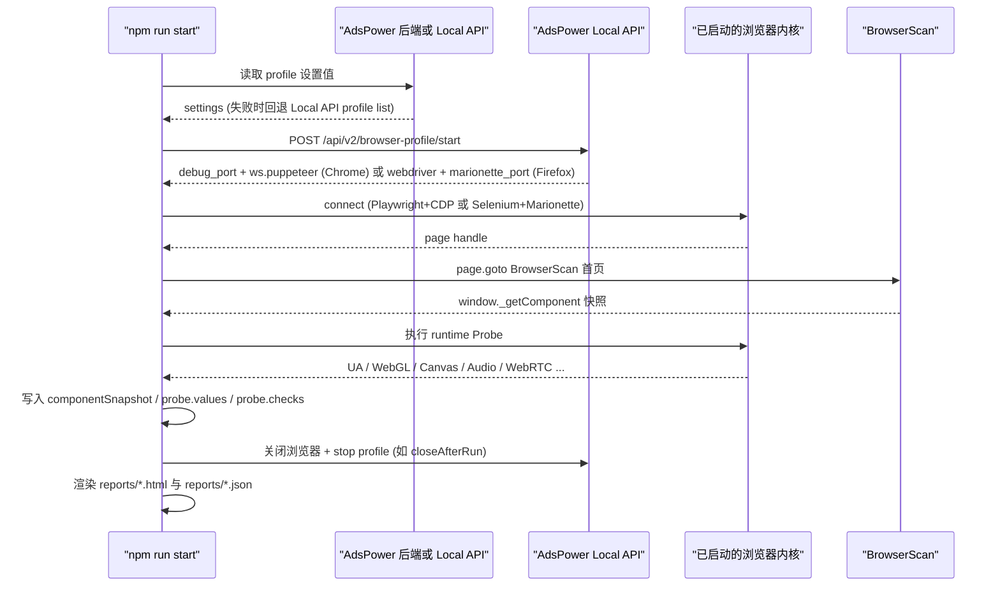
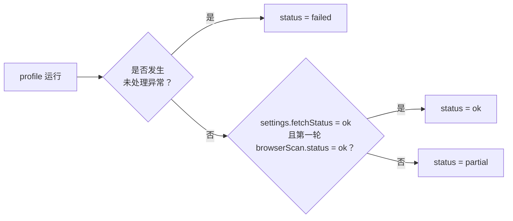

# zbc 指纹对比工具使用说明书

本文是 zbc 指纹对比工具的详细使用说明书。README 给的是"5 分钟跑起来"的最短路径，本文档覆盖配置字段、Chrome/Firefox 采集链路、报告解读、稳定性复测、差异报告、Windows 进阶脚本、常见问题排查与脱敏说明。

## 目录

- [使用说明书总览](#使用说明书总览)
- [运行前检查清单](#运行前检查清单)
- [配置文件字段说明](#配置文件字段说明)
- [标准采集流程](#标准采集流程)
- [浏览器连接链路](#浏览器连接链路)
- [报告产物说明](#报告产物说明)
- [如何解读报告](#如何解读报告)
- [稳定性复测](#稳定性复测)
- [报告差异对比](#报告差异对比)
- [Windows `run-scenario.ps1`](#windows-run-scenariops1)
- [常见问题排查](#常见问题排查)
- [安全与脱敏说明](#安全与脱敏说明)
- [验证命令与平台差异](#验证命令与平台差异)

## 使用说明书总览

工具解决四个问题：

- **手工慢**：不用逐个 profile 打开环境、复制配置、截图 BrowserScan；批量启动、采集并生成横向对比报告。
- **证据散**：HTML 展示给人工看，JSON 保留脱敏后的完整设置值、BS值、Probe 原始值和校验备注，方便回溯同一次验收。
- **来源难定位**：设置值、BS值、Probe值三类来源分开后，能更快判断问题卡在配置、浏览器生效、第三方采集还是网络视角。
- **容易误判**：对 UA、timezone、webgl_config 这类字段给出中性的一致性备注；对 Canvas、Audio、WebRTC 这类不能直接等价判断的字段，只提示 `需人工判断` 和 `Probe实测：xxx`，不把报告变成简单 pass/fail。

## 运行前检查清单

按顺序确认：

1. **Node.js 与依赖**：`node -v` 至少 v18+；`npm install` 已执行。
2. **AdsPower 客户端已启动**：能看到主界面，并且 Local API 在 50325 端口监听。
3. **Local API 可达**：

    ```bash
    # Windows (PowerShell)
    Invoke-WebRequest http://local.adspower.com:50325/api/v2/browser-profile/list -UseBasicParsing

    # macOS / Linux
    curl http://local.adspower.com:50325/api/v2/browser-profile/list
    ```

    macOS 上若 `local.adspower.com` 解析不通，把 `config.local.json` 里的 `localApiBaseUrl` 改成 `http://127.0.0.1:50325`。
4. **环境变量**：`$env:ADSPOWER_API_KEY`（Windows）或 `export ADSPOWER_API_KEY=...`（macOS/Linux）已设置。
5. **profile 已存在**：`profileIds` 里的 ID 必须在 AdsPower 客户端里能搜到。
6. **网络可达 BrowserScan**：`browserScanUrl` 默认 `https://www.browserscan.net/`。如果是代理环境，先确认代理允许访问该域名。

## 配置文件字段说明

`config.local.json` 的字段含义：

| 字段 | 必填 | 默认 | 说明 |
|---|---|---|---|
| `backendBaseUrl` | 是 | - | AdsPower 后端接口地址。优先从这里读取 profile 设置 |
| `localApiBaseUrl` | 是 | `http://local.adspower.com:50325` | AdsPower Local API 地址。启动/停止 profile、浏览器 profile 列表都从这里走 |
| `browserScanUrl` | 是 | `https://www.browserscan.net/` | BrowserScan 首页地址。**必须是首页**，子页面（如 `/webrtc`）没有 `_getComponent()` 快照，BS 值会全部"未获取" |
| `profileIds` | 是 | - | 要横向对比的环境 ID 列表，至少一个，全是非空字符串 |
| `closeAfterRun` | 否 | `true` | 运行完是否关闭浏览器和环境。`stabilityMode=restart` 且 `stabilityRuns > 1` 时必须为 `true` |
| `runMode` | 否 | `sequential` | profile 之间的运行模式，目前仅支持 sequential |
| `timeoutMs` | 否 | `60000` | 单个 BrowserScan 页面加载超时（毫秒） |
| `outputDir` | 否 | `reports` | HTML/JSON 报告输出目录 |
| `stabilityRuns` | 否 | `1` | 复测轮数，整数 1-5 |
| `stabilityMode` | 否 | `session` | 复测模式，`session` 或 `restart` |

`apiKey` **不**写在 `config.local.json` 里，统一通过环境变量 `ADSPOWER_API_KEY` 传入。

## 标准采集流程

对每个 profile，工具按顺序执行：



具体 8 步：

1. 读取设置值。优先走后端 `get-open-user-list`，失败后回退 Local API `/api/v2/browser-profile/list`。
2. 通过 Local API `/api/v2/browser-profile/start` 启动环境。
3. 根据返回的连接信息构造 Playwright（Chrome）或 Selenium（Firefox）客户端。
4. 打开 BrowserScan 首页。
5. 读取 BrowserScan `window._getComponent()` 快照，解码后写入 JSON 的 `browserScan.componentSnapshot`，同时映射到 BS 值。
6. 执行 runtime Probe，写入 JSON 的 `browserScan.probe.raw` 和 `browserScan.probe.values`。
7. 用设置值和 Probe 值生成 `browserScan.probe.checks`。
8. 生成 HTML/JSON 报告（`stabilityRuns > 1` 时还会跑多轮并生成 `stability` 块）。

### 控制台进度日志

跑批过程中控制台会按 profile 顺序输出阶段进度，关键阶段会在文案末尾附带耗时，便于判断卡点：

- `AdsPower 环境启动成功（Xms）`：环境启动耗时。
- `浏览器已连接（Xms）`：连接 CDP/Marionette 耗时。
- `BrowserScan 采集完成（Xms）` 或 `BrowserScan 采集未完成（Xms）`：采集阶段耗时，状态来自 `browserScan.status`。
- `完成：ok，BS 字段 N 个，Probe M 个（Xms）`：profile 总耗时。

BrowserScan 失败时控制台显示 `采集未完成`，且对应 profile 的 `notes` 会追加一条 `BrowserScan 采集失败：<error>`（错误文案与 `browserScan.error` 一致），方便在 JSON 报告里直接定位失败环节。

## 浏览器连接链路

### Chrome / Chromium

链路是 Playwright + CDP（Chrome DevTools Protocol）：

1. 工具从 Local API 的启动响应里取 `debug_port` 与 `ws.puppeteer`。
2. Playwright 用 `connectOverCDP(wsPuppeteer)` 附加到 AdsPower 已经启动的 Chrome/Chromium。
3. 通过 CDP 在已打开的 page 里 `goto` BrowserScan。
4. 后续读 `window._getComponent()`、执行 Probe JS 都走 CDP 通道。

如果 Local API 返回的 `debug_port` 端口被防火墙拦了，会报"CDP 连接失败"。

> fail-fast：如果 Local API 启动响应里既没有 `ws.puppeteer` 也没有 `debug_port`，工具会直接抛错 `profile <id> has no wsPuppeteer and no debugPort; cannot connect over CDP`，不再进入重试循环。常见原因是 AdsPower 客户端版本不兼容、profile 不是 Chrome/Chromium 内核，或启动响应里字段名差异。

### Firefox

链路是 Selenium + Marionette：

1. 工具从 Local API 的启动响应里取 `webdriver`（geckodriver 路径或 http 地址）和 `marionette_port`。
2. 工具启动一个本地 geckodriver 进程，并带上 `--marionette-host 127.0.0.1 --marionette-port <marionettePort>` 参数，让 geckodriver 通过 Marionette 协议**附加**到 AdsPower 已经启动的 Firefox 内核。
3. Selenium WebDriver 通过 geckodriver 操作这个 Firefox：`get` BrowserScan、读 `window._getComponent()`、执行 Probe JS。
4. 采集结束后通过 Marionette 协议断开，不会动 AdsPower 的环境。

> **重要：Firefox 不是"启动本机 Firefox"，是附加 AdsPower 已启动的 Firefox 内核**。如果 AdsPower 没有返回 `webdriver` 或 `marionette_port`，Firefox 采集会直接报错，目的是避免误采到本机 Firefox 的指纹。

### 浏览器类型识别

工具通过 `settings.browser` 或 `browser_kernel_config.type` 自动识别 Chrome 还是 Firefox，调用方**不需要**在配置里手动指定。

## 报告产物说明

| 路径 | 生成者 | 内容 | 是否 gitignored |
|---|---|---|---|
| `reports/fingerprint-report-*.html` | `npm run start` | 人工查看的横向对比报告 | 是 |
| `reports/fingerprint-report-*.json` | `npm run start` | 脱敏后的完整排查数据，含 `browserScan.componentSnapshot`、`probe.raw`、`probe.values`、`probe.checks`、`stability` 块 | 是 |
| `diff-reports/diff-report-*.{html,json}` | `npm run compare-reports` | 两份已生成报告的差异报告 | 是 |
| `runs/<run-id>/input/config.json` | `scripts/run-scenario.ps1` | 脱敏后的 config 快照（递归替换 `apiKey`/`token`/`password` 等为 `[REDACTED]`） | 是 |
| `runs/<run-id>/...` | `scripts/run-scenario.ps1` | 跑批日志、退出码、清理结果等辅助证据 | 是 |

> `runs/` 整个目录已被 `.gitignore` 忽略，请不要尝试 `git add -f runs/`。

## 如何解读报告

### 四类数据维度

| 列 | 来源 | 用途 |
|---|---|---|
| 设置值 | `results[].settings.settings` | 看"配置有没有下发到 profile" |
| BS值 | `results[].browserScan.values[field].value` | 看"profile 在第三方视角下暴露的指纹" |
| Probe值 | `results[].browserScan.probe.values[field].value`，通常只出现在 HTML 备注 | 看"设置值有没有真正在运行时生效" |
| 备注 | 字段级 + profile 级 | 解释差异、定位失败环节 |

如果 BrowserScan 没采到某个字段，BS 列保持"未获取"。即使 Probe 采到了 runtime 值，也只会在备注里以 `Probe实测：xxx` 出现。

### 顶部摘要与状态 badge

报告顶部有 7 个摘要 tile（Profile 数、Fingerprint 项目数、OK、Partial、Error、需人工判断、未获取 BS 值），每个 profile 列头还有一个状态 badge（OK / Partial / Error）。它们是用来帮助一眼看清采集完整度的速览，不替代针对单字段的中性判断；具体结论仍要看"设置值 / BS值 / Probe / 备注"四类数据维度。HTML 展示层调整不改变 JSON 报告的字段结构，`results[].status`、`browserScan.probe.checks`、`stability` 等保持一致。

### profile 状态组合

profile 级 `status` 的判定由 `src/runner.ts` 的 `statusFor` 与外层 `catch` 共同决定，规则如下：

- `failed`：profile 运行过程中出现未处理异常（runner.ts 外层 `catch` 命中）。
- `ok`：`settings.fetchStatus === "ok"` 且第一轮 `browserScan.status === "ok"`。
- `partial`：除 `failed` 之外的所有情况，即配置值或第一轮 BrowserScan 至少一侧不完整。



更细的状态词见 [§ 状态与返回结果说明](#状态与返回结果说明)。

### BS 值为空怎么办

按顺序排查：

1. `browserScanUrl` 是不是首页？子页面（`/webrtc`、`/canvas` 等）没有 `_getComponent()` 快照，BS 值会显示"未获取"。把 `browserScanUrl` 改回 `https://www.browserscan.net/`。
2. BrowserScan 页面是否加载完成？看 `browserScan.error`：`page.goto` 超时通常说明代理或网络问题。
3. 是否触发了 BrowserScan 的反爬？多次冷启动复测时建议每次之间留几秒间隔。
4. `componentSnapshot` 是否存在？JSON 报告里 `browserScan.componentSnapshot` 是解码后的原始结构，BS 字段映射是从这里读的；如果 snapshot 为空，所有 BS 值都会"未获取"。

### Probe 值和 BS 值不一致怎么办

这不一定是问题。Probe 和 BS 的语义经常不对等：

- **UA、timezone、language、screen、dpr、hardware_concurrency、device_memory、do_not_track、webgl_config**：可对等比较，备注会是 `设置值与 Probe一致` 或 `需人工判断`。
- **canvas、webgl、webgl_image、audio、client_rects、fonts、media_devices、webrtc**：设置值是开关/模式，Probe 是 hash 或列表，不能强判定。备注统一为 `需人工判断`。
- **tls、ip、ip_country、ip_region、ip_city**：服务端/网络视角，JS Probe 验不了，备注为 `无法通过 JS 校验`。

### Probe 异步子项的并行采集

`audioHash`、`mediaDevices`、`webrtc`、`webgpu` 这四个异步子项在 BrowserScan 页面里通过 `Promise.all` 并行采集，每个子项都有独立的真实超时（`audioHash` 4s、其余 5s）。任一子项超时或报错只会在 `_probeTimeouts` / `_probeErrors` 里记一条，不会阻塞其他子项返回值，因此一组 Probe 不会因为单个慢检测项而整体退化到只有 `probe.error`。这些子项是 `canvas / audio / webgl_image / client_rects / fonts / media_devices / webrtc` 等"需人工判断"字段的主要来源，单独看缺失是正常现象。

详细分析见 [§ 为什么只改代理或 WebGL 后部分 BS 值会变化](#为什么只改代理或-webgl-后部分-bs-值会变化)。

## 稳定性复测

`stabilityRuns` 可设为 1-5（默认 1）。`stabilityMode` 默认为 `session`。

### 两种模式

- `session`：Profile 只启动一次，浏览器只连接一次，连续采集 N 轮。用于观察 BrowserScan 页面/采集过程在同一次会话内的短时间波动（WebGPU、Client Rects 等运行时字段）。
- `restart`：每轮都执行 `start → connect → collect → close → stop`。用于观察同一个 profile 多次冷启动后 BrowserScan 字段是否一致。该模式**要求 `closeAfterRun=true`**。

### 行为说明

- `browserScan` 始终是第一轮采集结果，HTML 报告和现有 JSON 消费者行为不变。
- `stability.runs` 保存全部 N 轮的 `browserScan` 数据。
- `stability.fields` 是字段波动摘要，状态为 `unchanged` / `changed` / `not_collected`。
- `stability.mode` 表示复测模式。
- `changed` **不是失败**，只表示多轮采到的值不同，需结合设置值、BS值、Probe、`componentSnapshot` 综合判断。
- `browser_scan_raw_text` 不纳入 `stability.fields`，避免 JSON 变大且无意义。
- `restart` 模式不自动修改代理、不自动改 WebGL、不编辑 AdsPower profile，只重复启动同一个 profile。

### 字段状态

| 状态 | 含义 |
|---|---|
| `unchanged` | 该字段在所有轮次中采集到的非空值相同 |
| `changed` | 该字段在多轮中采集到的非空值不完全相同 |
| `not_collected` | 该字段在所有轮次中都没有采集到有效值 |

失败轮次中没有采到的空值不参与 `changed/unchanged` 判断。例如 3 轮中 1 轮 BrowserScan 失败、另外 2 轮 `webgl` 都是同一个值，则 `webgl` 仍为 `unchanged`，但 `samples` 会显示那一轮没有值。

### JSON 新增字段

```json
{
  "stability": {
    "mode": "session",
    "runCount": 2,
    "runs": [
      { "runIndex": 1, "browserScan": { "...": "第一轮完整结果" } },
      { "runIndex": 2, "browserScan": { "...": "第二轮完整结果" } }
    ],
    "fields": {
      "ua":    { "status": "unchanged", "samples": ["..."], "uniqueValues": ["..."] },
      "webgl": { "status": "changed",   "samples": ["..."], "uniqueValues": ["..."] }
    }
  }
}
```

## 报告差异对比

对比两份已经生成的报告，输出 HTML/JSON 差异报告。该功能**不启动 AdsPower，不访问 BrowserScan，不重新采集**，只读取已有报告 JSON 比较设置值、BS值、Probe值是否变化。

### 使用方式

#### Windows（PowerShell）

```powershell
npm.cmd run compare-reports -- reports\old.json reports\new.json
npm.cmd run compare-reports -- reports\old.html reports\new.html
```

#### macOS（bash / zsh）

```bash
npm run compare-reports -- reports/old.json reports/new.json
npm run compare-reports -- reports/old.html reports/new.html
```

> macOS 上路径分隔符使用 `/`，不要写成 `reports\old.json`；使用 `npm`，不要使用 `npm.cmd`。

第一个路径是旧报告/基准报告，第二个路径是新报告/当前报告。HTML 路径会自动查找同名 JSON。

### 输出位置

输出固定写入 `diff-reports/` 子目录，文件名包含时间戳：

```
diff-reports/diff-report-<timestamp>.html
diff-reports/diff-report-<timestamp>.json
```

### 状态词

| 状态 | 含义 |
|---|---|
| `无变化` | 旧报告和新报告中该值相同 |
| `有变化` | 旧报告和新报告中该值不同 |
| `新增值` | 旧报告中缺失，新报告中有值 |
| `丢失值` | 旧报告中有值，新报告中缺失 |
| `均未获取` | 两边都没有值 |

### 三类来源对比

对每个 profile 的每个指纹字段，比较三类来源：

1. **设置值**：`settings.settings[field]`
2. **BS值**：`browserScan.values[field].value`
3. **Probe值**：`browserScan.probe.values[field].value`

Probe 仍为辅助来源，**不能顶替 BS**。如果只有 Probe 变化，字段高亮为 `soft`；如果设置值或 BS 值变化，高亮为 `strong`。

### 归一化比较规则

- `undefined`、`null`、字段不存在，都视为缺失。
- 字符串只 trim 首尾空白后比较，不做其他规范化。
- 对象按结构比较，key 顺序不影响结果。
- 数组按顺序比较，顺序不同算不同。
- 深层 diff 排除 `rawText`、`browser_scan_raw_text` 以及含 `rawText` 的 key。

### 兼容旧报告

如果报告 JSON 缺少 `probe`、`componentSnapshot`、`stability`，按缺失处理，不阻塞设置值/BS值对比。如果缺少 `profileIds`，从 `results[].profileId` 推导。

### 错误处理

- 报告路径不存在：报错并退出。
- 传 HTML 但找不到同名 JSON：报错并退出。
- JSON 解析失败或缺少 `results[]`：报错并退出。

## Windows `run-scenario.ps1`

`scripts/run-scenario.ps1` 是 Windows PowerShell 的进阶批跑脚本，封装"启动 AdsPower → 跑 `npm run start` → 收日志 → 清理"的完整流程。普通单次采集**不需要**用它，直接 `npm run start` 即可。

### 什么时候用

- 需要批量跑多组 profile 配置做对比实验。
- 需要在 CI 或调度器里跑采集，并把每次跑批的日志、配置、退出码分开存档。
- 需要把 `config.local.json` 复制到 `runs/<run-id>/input/config.json` 里留档，但**不能**让 API key 跟着落盘。

### 生成什么目录

每次执行会生成一个 `runs/<时间戳>-<场景名>/` 目录，例如 `runs/20260522-140751-real-adspower-check/`，包含：

- `input/config.json`：本次跑批用的配置快照，**已经递归脱敏**（详见下文）。
- 控制台日志、退出码、清理结果等辅助证据。

### config snapshot 已脱敏

脚本写入 `runs/<run>/input/config.json` 时，会递归扫描 JSON，遇到以下键名时把值替换为 `[REDACTED]`：

```
apiKey, api_key, authorization, bearer, token,
secret, password, passwd, cookie, proxy_password,
client_secret, access_key, private_key, user_proxy_config
```

匹配方式是**精确大小写不敏感**。因此：

- `apiKey`、`API_KEY`、`apikey` 都会被脱敏。
- `X-Token`、`X-Auth-Token`（带连字符或下划线前缀的复合键）**不会**被脱敏，因为工具只匹配键名整体，不做子串匹配。
- 嵌套对象、对象数组、对象内字段都会被脱敏。

> 即便已经脱敏，`runs/` 仍然在 `.gitignore` 里，不要尝试提交。

## 常见问题排查

### 1. AdsPower 客户端没启动

现象：Local API 报"无法连接 50325"或返回非 JSON 响应。
处理：先启动 AdsPower 主程序，等 Local API 起来再跑。

### 2. Local API 不通

- `local.adspower.com` 解析失败（macOS 较常见）：把 `localApiBaseUrl` 改成 `http://127.0.0.1:50325`。
- 端口被占用或防火墙拦截：换成空闲端口或放行规则。
- Local API key 与后端 API key 不同：确认 `ADSPOWER_API_KEY` 对应的是后端 API key。

### 3. BrowserScan 打不开 / `page.goto` 超时

- 代理问题最常见。看 `browserScan.error`，如果是 timeout 就要检查代理出口。
- 多次冷启动复测时 BrowserScan 触发反爬：拉长跑批间隔，或临时调低 `stabilityRuns`。
- 浏览器语言/时区差异导致 BrowserScan 给出地区受限页：保持 `settings` 里 `language` 与 `timezone` 配对合理。

### 4. Firefox `marionette_port` / `webdriver` 缺失

现象：工具在 Firefox profile 采集时报"AdsPower Firefox endpoint is not attachable"。
原因：当前 AdsPower 启动的 Firefox 没启用 Marionette 或 Local API 没返回对应字段。
处理：

- 确认 AdsPower 客户端版本支持 Firefox 内核。
- 在 AdsPower 客户端里启动该 profile，确认本地能正常打开。
- 如果版本不支持，请回退到 Chrome/Chromium profile。

> 不要绕过这个保护去采集本机 Firefox，那样会拿到本机指纹而不是 AdsPower 启动的环境指纹，结果没有意义。

### 5. 代理导致 BrowserScan `partial`

代理出口 IP 变化时，经度、纬度、timezone、language 这类跟 IP 地理库相关的 BS 值会随之变化，这是**预期现象**，不是失败。详细解释见 [§ 为什么只改代理或 WebGL 后部分 BS 值会变化](#为什么只改代理或-webgl-后部分-bs-值会变化)。

### 6. BS 值未获取

- 检查 `browserScanUrl` 是不是首页。
- 看 `browserScan.componentSnapshot` 是否有内容。
- 看 `browserScan.error` 定位采集失败的环节。

### 7. Chrome/CDP 启动响应缺 `ws.puppeteer` 或 `debug_port`

现象：profile 跑批时立刻报 `profile <id> has no wsPuppeteer and no debugPort; cannot connect over CDP`，伴随 `browserScan.error` 同义文案、`notes` 中追加 `BrowserScan 采集失败：...`，控制台进度为 `BrowserScan 采集未完成`。
原因：Local API 启动响应里既没有 `ws.puppeteer` 也没有 `debug_port`，工具直接 fail-fast 而不再重试。
处理：

- 确认 AdsPower 客户端是较新版本，且该 profile 是 Chrome/Chromium 内核（Firefox 内核不会返回这两字段，属正常情况）。
- 重新启动该 profile 一次再采集；偶发于 AdsPower Local API 缓存或内核尚未完全就绪。
- 仍无法获取时，回到 AdsPower 客户端手动启动 profile，确认能正常打开浏览器，再回到本工具采集。

## 安全与脱敏说明

### 报告脱敏

报告写入前会对密码、token、cookie、代理密钥、Authorization、API key 等值脱敏为 `[REDACTED]`。脱敏逻辑在 `src/probeValidation.ts` 内的嵌套脱敏里实现，**同时覆盖顶层和嵌套结构**。

### 配置文件脱敏

`scripts/run-scenario.ps1` 在把 `config.local.json` 复制到 `runs/<run>/input/config.json` 之前会做递归脱敏。脱敏键名见上文 [§ config snapshot 已脱敏](#config-snapshot-已脱敏)。

### Git 忽略

`.gitignore` 已忽略：

- `config.local.json`（真实本地配置）
- `runs/`（run-scenario 跑批产物，含脱敏 config snapshot）
- `reports/`（HTML/JSON 报告产物）
- `diff-reports/`（差异报告产物）
- `.env`、`*.log`、`.claude/`

> 脱敏依赖键名精确匹配，**无法覆盖所有敏感写法**。不要把 `runs/`、`reports/`、`diff-reports/` 提交到仓库；如确实需要外发报告，请先打开 JSON 手动扫一遍可疑字段。

### 密钥轮换建议

如果 `apiKey` 曾以明文形式落盘到本机任何目录（即使未被 git 追踪），强烈建议在 AdsPower 控制台立即轮换。git 历史干净无法证明这个 key 没有被压缩、复制或外发过。

## 为什么只改代理或 WebGL 后部分 BS 值会变化

### 总体结论

- BS值是 BrowserScan 第三方页面在当前浏览器运行环境中实时计算出来的结果。
- 有些 BS 指纹项不是单纯等于 AdsPower 的某个设置值，而是由代理出口、浏览器渲染管线、图形接口、DOM 布局测量、WebGL/WebGPU 能力等多个因素共同计算出来。
- 所以，在只改代理信息或 WebGL 元数据后，部分 BS 值变化是正常现象。
- 这些变化应该结合"设置值、BS值、Probe实测、备注"一起判断，不要简单当成通过/失败。

### 逐项解释

#### 1. 经度、纬度

经度、纬度不是浏览器本地配置直接决定的。BrowserScan 通常根据出口 IP 的地理位置数据库返回 country、region、city、latitude、longitude、timezone 等信息。因此只要代理出口 IP 变了，经度和纬度变化就是预期现象。这类字段应该归因到代理/IP 地理位置，而不是 WebGL 或浏览器硬件指纹。

> 参考源码：`mix_scan/src/composables/useIP.ts`，其中 `ip_data` 包含 city、country、region、latitude、longitude、timezone 等字段。

#### 2. WebGL

BrowserScan 的 webgl BS值通常不是单个 vendor 或 renderer 字符串，而是对一整组 WebGL 检测结果做 hash。这组检测结果包含 `UNMASKED_VENDOR_WEBGL`、`UNMASKED_RENDERER_WEBGL`，以及 WebGL 参数、扩展、渲染能力等。因此修改 AdsPower 的 `webgl_config`（例如 vendor / renderer），导致 BrowserScan 的 webgl hash 变化，是正常且预期的。判断时应优先看 webgl_config 的设置值、BS 展示值、Probe 读取到的 `UNMASKED_VENDOR_WEBGL` / `UNMASKED_RENDERER_WEBGL` 是否方向一致，而不是只盯 hash 是否变化。

> 参考源码：`mix_scan/src/utils/sources/webgl.ts`（读取 `UNMASKED_VENDOR_WEBGL` 和 `UNMASKED_RENDERER_WEBGL`）、`mix_scan/src/components/index/hardware.vue`（`webGLReportHash` 对 `webgl.value` JSON 序列化后做 SHA1）。

#### 3. Client Rects

Client Rects 来自浏览器对 DOM 元素布局结果的测量，例如 `getClientRects()`。它受字体、DPR、缩放、渲染管线、图形环境、CSS transform、浏览器版本、反指纹噪声等影响。Client Rects 不是直接依赖 WebGL 元数据，但它对渲染环境非常敏感。如果只改 WebGL 后 Client Rects 也发生变化，不能直接说明 WebGL 影响了 Client Rects；更准确的说法是：BrowserScan 的 Client Rects 采集结果可能受渲染环境、噪声策略或测量时机影响。如果工具里的 Probe Client Rects 稳定，但 BS 的 Client Rects 变化，应标记为"需人工判断"，不要直接判失败。

> 参考源码：`mix_scan/src/utils/sources/clientRect.ts`（创建 DOM 元素并读取 `getClientRects()[0].toJSON()`）、`mix_scan/src/components/index/hardware.vue`（`clientRectHash` 对 `clientRect.value` 做 SHA1）。

#### 4. GPU

BrowserScan 里的 GPU 项不一定等同于 WebGL renderer。它可能来自 WebGPU、GPU adapter、WGSL language features、limits/features 等信息的组合 hash。因此 GPU BS值变化不一定代表真实显卡变了，也可能是 WebGPU 返回对象、特性数组顺序、浏览器图形后端、WebGL/WebGPU 适配策略变化导致。如果只看到 GPU hash 变化，应继续查看 raw/probe 里的 WebGPU 或 GPU 相关原始信息，不要仅凭 hash 判失败。

> 参考源码：`mix_scan/src/utils/sources/webgpu.ts`（采集 `navigator.gpu`、adapter、features、limits、`wgslLanguageFeatures` 等）、`mix_scan/src/components/index/hardware.vue`（`webGPUHash` 对 `webGPU.value` JSON 序列化后做 SHA1）。

### 建议的排查方式

- 如果要判断代理影响，只改代理，WebGL 配置保持不变，连续跑两次报告。
- 如果要判断 WebGL 影响，只改 WebGL 元数据，代理保持不变，连续跑两次报告。
- 如果要判断采集稳定性，完全不改任何配置，连续跑两次报告。
- 对经度、纬度、timezone、language 这类字段，优先检查代理出口 IP 和 IP 地理库结果。
- 对 webgl、gpu、client_rects 这类 hash 字段，不要只看 hash 是否变化，要结合 BrowserScan 原始值、Probe 实测值和备注判断。
- 结论文案要使用"正常/可解释/需人工判断/建议复测"这类中性说法，不要写成强通过或强失败。

## 状态与返回结果说明

报告里所有状态/返回值都用中性措辞，不做通过/失败判定。

### 一、配置阶段错误

| 错误信息 | 含义 |
|---|---|
| `apiKey is required` | 未设置 API key，工具无法调用 AdsPower 接口 |
| `profileIds must contain at least one profile id` | 未传入任何 profile ID |
| `profileIds must only contain non-empty strings` | profile ID 列表中包含空字符串 |
| `backendBaseUrl is required` | 未设置后端接口地址 |
| `localApiBaseUrl is required` | 未设置 Local API 地址 |
| `browserScanUrl is required` | 未设置 BrowserScan 地址 |
| `stabilityRuns must be an integer between 1 and 5` | 复测轮数超出 1-5 范围 |
| `stabilityMode must be "session" or "restart"` | 稳定性模式值不合法 |
| `stabilityMode restart requires closeAfterRun=true when stabilityRuns > 1` | 冷启动复测需要 closeAfterRun=true |

### 二、`results[].status`（profile 整体）

| 状态 | 含义 |
|---|---|
| `ok` | 设置值获取成功，并且第一轮 BrowserScan 采集成功 |
| `partial` | 设置值或第一轮 BrowserScan 有一边不完整 |
| `failed` | profile 运行过程中出现未处理异常 |

### 三、`results[].settings.fetchStatus`

| 状态 | 含义 |
|---|---|
| `ok` | 后端或 Local API 取到了 AdsPower profile 设置 |
| `failed` | 设置值获取失败，原因在 `results[].settings.error` |

### 四、`results[].browserScan.status`

| 状态 | 含义 |
|---|---|
| `ok` | BrowserScan 采集成功 |
| `failed` | 启动环境、连接 CDP/Marionette、访问 BrowserScan 或采集过程失败，原因在 `results[].browserScan.error` |

失败可能出现在：环境启动超时、CDP/Marionette 连接失败、BrowserScan 页面加载超时、页面 DOM 解析异常等。`browserScan.error` 字段可定位具体环节。

### 五、`stability.mode`

| 模式 | 含义 |
|---|---|
| `session` | 同一个已启动环境中连续采集多轮，观察 BrowserScan 页面/采集过程本身的短时间波动 |
| `restart` | 每轮执行 `start → connect → collect → close → stop`，观察冷启动后的指纹稳定性。要求 `closeAfterRun=true` |

`stabilityRuns` 为 1 时通常不会生成 stability 摘要；设置为 2-5 时才有复测意义。

### 六、`stability.fields[field].status`

| 状态 | 含义 |
|---|---|
| `unchanged` | 多轮采到的非空值一致 |
| `changed` | 多轮采到的非空值不一致；不是失败，只表示有波动 |
| `not_collected` | 所有轮次都没有采到这个字段 |

### 七、`stability.runs[].browserScan.status`

| 状态 | 含义 |
|---|---|
| `ok` | 该轮 BrowserScan 采集成功 |
| `failed` | 该轮没有采集到 BrowserScan，原因在 `stability.runs[].browserScan.error` |

"冷启动复测有 1/3 轮未采集到 BrowserScan" 表示 3 轮中有 1 轮失败、2 轮成功。这是该 profile 的复测摘要，不是每个指纹项都失败。`stability.runs[].browserScan.status` 描述的是该 profile 该轮 BrowserScan 采集的整体结果。

### 八、`BrowserScanValue.source`

| 来源 | 含义 |
|---|---|
| `dom` | 从 BrowserScan 页面 DOM 读取 |
| `runtime` | 从 BrowserScan 页面运行态/组件快照读取（即 `window._getComponent()` 快照） |
| `probe` | 工具自己的 JS Probe 采集到的辅助实测值 |
| `not_collected` | 未采到该字段 |

> Probe 值**不能顶替 BS 值**。BrowserScan 没采到时，BS值仍应显示未获取。

### 九、Probe 校验状态

| 状态 | 含义 |
|---|---|
| `一致` | 设置值和 Probe 实测值可直接比较且一致 |
| `需人工判断` | 字段可辅助观察，但不能自动判定 |
| `无法通过 JS 校验` | 该字段不适合通过页面 JS Probe 验证（TLS、出口 IP、HTTP header 等） |

### 十、备注来源

HTML 备注可能来自：

- BrowserScan 字段自身备注
- 字段依赖说明
- Probe 校验备注（`设置值与 Probe一致` / `需人工判断`）
- Probe 实测值（`Probe实测：xxx`）
- profile 级摘要（冷启动复测多少轮未采集到 BrowserScan）
- 关闭浏览器/关闭环境时的清理提示

当前 HTML 备注区域可能比较长，因为字段级备注和 profile 级备注会合并。

## 验证命令与平台差异

### 验证

```powershell
# Windows
npm.cmd run typecheck
npm.cmd test
```

```bash
# macOS / Linux
npm run typecheck
npm test
```

### macOS 平台差异

- **环境前置**：
  - 已安装 Node.js 和 npm（建议官方 LTS，或 nvm）。
  - 已启动 AdsPower 客户端，Local API 可用，默认 `http://local.adspower.com:50325`。
  - 如果 `local.adspower.com` 解析不通，把 `localApiBaseUrl` 改成 `http://127.0.0.1:50325`。
- **命令差异**：
  - `cp` 代替 `Copy-Item`。
  - `export ADSPOWER_API_KEY="..."` 代替 `$env:ADSPOWER_API_KEY=...`。
  - `npm` 代替 `npm.cmd`（`npm.cmd` 是 Windows / cmd 下的可执行文件名，macOS 上不存在）。
  - 路径分隔符用 `/`，不要用 `\`。
- **Firefox 采集链路**：Firefox 内核环境并非用本机 Firefox 采集。工具会通过 AdsPower Local API 启动 profile，并使用 AdsPower 返回的 `webdriver` + `marionette_port`，通过 geckodriver + Marionette 附加到 AdsPower 已启动的 Firefox 环境。如果 macOS 版 AdsPower 未返回 `webdriver` 或 `marionette_port`，Firefox 采集会报错，以避免误采本机指纹。
- **Windows 专用脚本**：`scripts/run-scenario.ps1` 是 Windows PowerShell 辅助脚本，macOS 不作为推荐入口；如需类似辅助，请直接使用 `npm run start -- --config config.local.json`。
